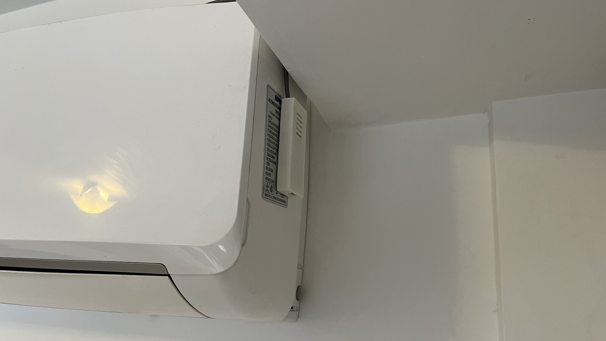

# Surrey / Whirlpool AC control with Apple Home
* Remote control unit: `DG11J1-01`.
* Exposes metrics to a [Prometheus pushgateway server](https://github.com/prometheus/pushgateway).

Read more at my blog: [Controlling AC Units with Apple Home and Siri](https://blog.nico.ninja/controlling-ac-units-apple-home/)

## External libraries

 * https://github.com/Mixiaoxiao/Arduino-HomeKit-ESP8266 
 * https://github.com/crankyoldgit/IRremoteESP8266
